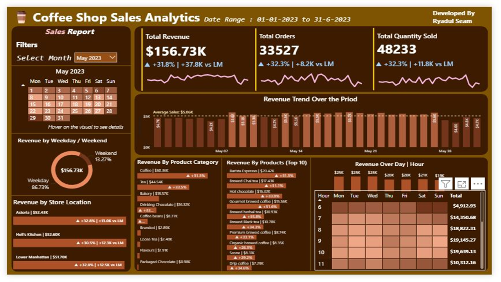
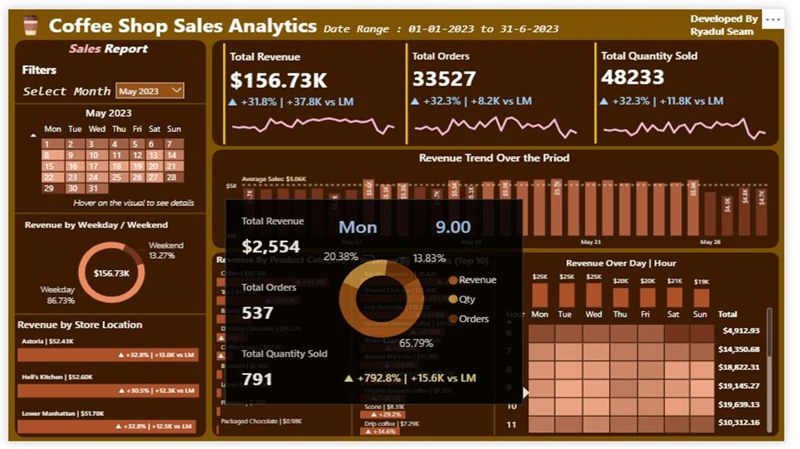
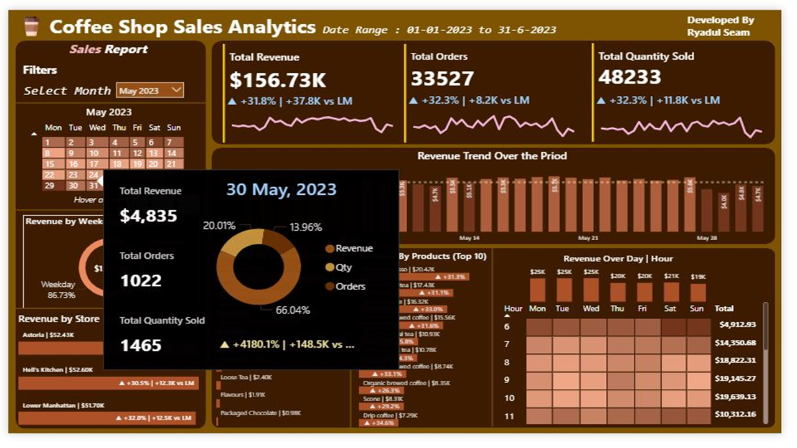

# ☕ Coffee Shop Sales Analytics Dashboard

**End-to-End Sales Performance Analysis & Business Intelligence Solution for a Multi-Location Coffee Shop Chain**



Analyzing **149,116 transactions** across three locations to uncover sales trends, growth drivers, and optimization opportunities using **SQL, Python, and Power BI**.

---

## 📌 Table of Contents

- [Project Overview](#-project-overview)
- [Business Problem](#-business-problem)
- [Dataset](#-dataset)
- [Tech Stack](#-tech-stack)
- [Project Structure](#-project-structure)
- [Pipeline Workflow](#-pipeline-workflow)
- [Data Cleaning & Feature Engineering](#-data-cleaning--feature-engineering)
- [SQL Analysis Highlights](#-sql-analysis-highlights)
- [Power BI Dashboard](#-power-bi-dashboard)
- [Key Insights](#-key-insights)
- [Predictive Modeling](#-predictive-modeling)
- [Getting Started](#-getting-started)
- [Reports](#-reports)
- [Final Recommendations](#-final-recommendations)
- [Author & Contact](#-author--contact)
- [License](#-license)

---

## 📌 Project Overview

Three coffee shop locations — **Astoria, Hell's Kitchen, and Lower Manhattan** — had zero visibility into peak hours, product performance, or staffing needs, and decisions were made on intuition rather than data.

This project builds a full analytics pipeline to answer:

- When do sales actually peak, down to the hour?
- Which products and categories drive the most revenue?
- How does performance differ by store, weekday/weekend, and month?
- What will next month's sales look like, and can revenue or product category be predicted from transaction attributes?

**Key result:** Identified **+31.8% Month-over-Month revenue growth** in May 2023, pinpointed the **8–10 AM service window** as the critical daily surge period, and delivered a live Power BI dashboard for ongoing decision-making.

---

## 💼 Business Problem

In a competitive coffee shop industry, understanding daily, weekly, and monthly sales patterns is crucial. This project aims to:

- Identify peak performance periods and underperforming days
- Analyze product category and store-wise contribution
- Measure Month-over-Month (MoM) growth trends
- Forecast future revenue
- Support data-driven decisions for inventory, staffing, and marketing

---

## 🗃️ Dataset

- **Source:** `coffee_shop_raw_data.csv` (149,116 rows)
- **Time Period:** January 1, 2023 – June 30, 2023
- **Key Columns:** Transaction ID, Date, Time, Quantity, Store Location, Product Category, Unit Price, etc.
- **Processed Versions:** `coffee_shop_clean_data.csv` and `coffee_shop_engineered.csv`

---

## 🛠️ Tech Stack

| Layer | Tools |
|---|---|
| Database | PostgreSQL |
| ETL & Analysis | Python (pandas, NumPy, SQLAlchemy) |
| Machine Learning | scikit-learn (RandomForestClassifier, LinearRegression) |
| Forecasting | Facebook Prophet |
| Visualization (EDA) | matplotlib, seaborn |
| BI Dashboard | Power BI (Power Query, DAX) |
| Data Modeling | Custom calendar table, star-schema-style relationships |
| Others | Git, GitHub |

---

## 🗂️ Project Structure

```bash
coffee-shop-sales-analytics/
│
├── README.md
├── data/
│   ├── raw/
│   │   └── coffee_shop_raw_data.csv          # Original, unprocessed transaction data
│   └── processed/
│       ├── coffee_shop_clean_data.csv        # Cleaned dataset
│       └── coffee_shop_engineered.csv        # Feature-engineered dataset
│
├── scripts/
│   ├── ETL_Pipeline.py                       # Clean, transform, and load data into PostgreSQL
│   ├── EDA_Analysis.py                       # Exploratory data analysis & visualizations
│   ├── Feature_Engineering.py                # Derived features (hour, weekday, price tier, etc.)
│   ├── Forecasting.py                        # Prophet-based 30-day revenue forecast
│   ├── Predicting_Product_Category.py        # Random Forest classifier for product category
│   └── Predicting_Transaction_Revenue.py     # Linear regression for transaction revenue
│
├── sql/
│   ├── db_schema.sql                         # PostgreSQL table schema
│   └── SQL_Queries.sql                       # Full analytical query set (CTEs, window functions)
│
├── dax/
│   └── measures.dax                          # Power BI DAX measures (KPIs, MoM growth, calendar table)
│
├── reports/
│   ├── executive_summary.pdf                 # Strategic summary & recommendations
│   ├── project_presentation.pdf              # Stakeholder-facing slide deck
│   └── full_sql_queries_with_outputs.docx    # SQL queries with result sets
│
└── dashboard_images/
    ├── dashboard_overview.png                # Power BI dashboard - main view
    ├── insights_page.png                     # Drill-through / tooltip detail view
    └── revenue_trend.png                     # Daily revenue trend detail view
```

---

## 🔄 Pipeline Workflow

```
Raw CSV (149,116 rows)
        │
        ▼
  ETL_Pipeline.py        → cleans, types data, derives datetime features → loads to PostgreSQL
        │
        ▼
  EDA_Analysis.py        → exploratory visuals: category, hourly, and store-level trends
        │
        ▼
  Feature_Engineering.py → hour/day/month/weekday, total_amount, basket_size, price_category
        │
        ├──▶ Predicting_Product_Category.py    (Random Forest classification)
        ├──▶ Predicting_Transaction_Revenue.py (Linear Regression)
        └──▶ Forecasting.py                    (Prophet 30-day forecast)
        │
        ▼
  PostgreSQL             → SQL_Queries.sql (MoM growth, peak hours, weekday/weekend, top products)
        │
        ▼
  Power BI               → measures.dax + dashboard visuals → Executive Summary & Presentation
```

---

## 🧹 Data Cleaning & Feature Engineering

- Converted raw timestamps into proper datetime format
- Created new features: `total_amount`, `hour`, `weekday`, `month`, `price_category`, `basket_size`
- Handled data types and validated the engineered dataset for analysis
- Built a modular SQL schema and loaded data into PostgreSQL
- Performed correlation and distribution analysis to detect peak hours and weekend vs. weekday differences

---

## 📊 SQL Analysis Highlights

The `sql/SQL_Queries.sql` file contains modular, CTE-driven queries covering:

- Month-over-Month growth for total sales, order count, and quantity sold (via `LAG() OVER (ORDER BY month)`)
- Daily sales vs. average classification (`ABOVE AVERAGE` / `BELOW AVERAGE`) using window functions
- Weekday vs. weekend revenue split
- Store location and product category/type performance ranking
- Hour-of-day and day-of-week revenue heatmap data

Full query outputs are documented in `reports/full_sql_queries_with_outputs.docx`.

---

## 📈 Power BI Dashboard

An interactive single-page dashboard (Date Range: 01-01-2023 to 30-06-2023) featuring:

- **KPI cards** — Total Revenue, Total Orders, Total Quantity Sold, each with MoM sparkline and % change
- **Revenue trend** — daily bar chart with average sales reference line and interactive tooltips
- **Revenue by weekday/weekend** — donut chart
- **Revenue by store location** — ranked bar chart with MoM deltas
- **Revenue by product category & top 10 products** — ranked bars with growth indicators
- **Revenue heatmap** — day × hour matrix highlighting peak service windows
- Custom calendar table and dynamic MoM measures built entirely in DAX (see `dax/measures.dax`)

| Overview | Hourly Insight | Daily Drill-down |
|---|---|---|
|  |  |  |

---

## 🔍 Key Insights

- **Revenue growth:** May 2023 posted **+31.8% MoM revenue growth** (+$37.8K), with orders and quantity sold both up 32.3%.
- **Overall performance:** Total Revenue = **$156.73K**, Orders = **33,527**, Quantity Sold = **48,233** across the analysis period.
- **Weekday dominance:** **86.73%** of revenue comes from weekdays vs. **13.27%** on weekends — marketing spend should target the weekday commuter crowd, not weekend footfall.
- **Peak service window:** Revenue peaks at 8:00 AM (**$18,822**) and 10:00 AM (**$19,639**); order volume peaks separately at 10:00 AM, indicating a throughput-driven (not just ticket-size-driven) rush that needs "all-hands" staffing.
- **Product hierarchy:** Coffee (**$60.4K**) and Tea (**$44.5K**) dominate category revenue, with Barista Espresso (**$20.4K**) and Brewed Chai Tea (**$17.4K**) as hero SKUs.
- **Store performance:** All three locations showed strong growth, with Hell's Kitchen leading as the top-performing store and serving as the benchmark for the other two.
- **Anomaly detection:** May 30th alone accounted for **~20%** of the month's total revenue — a single-day spike worth investigating for replicable demand drivers (e.g. promotions, local events).

Full strategic recommendations are available in `reports/executive_summary.pdf`.

---

## 🤖 Predictive Modeling

| Model | Script | Target | Method |
|---|---|---|---|
| Revenue Forecast | `Forecasting.py` | Daily total revenue, next 30 days | Facebook Prophet |
| Transaction Revenue | `Predicting_Transaction_Revenue.py` | `total_amount` per transaction | Linear Regression |
| Product Category | `Predicting_Product_Category.py` | `product_category` | Random Forest Classifier |

Both classification and regression models use `unit_price`, `transaction_qty`, `hour`, and `month` as core features derived during feature engineering.

---

## ⚙️ Getting Started

### Prerequisites

**Required:**
- Python 3.9+ 
- PostgreSQL 13+
- Power BI Desktop (for dashboard)

**Recommended Tools:**
- VS Code (with Python extension)
- Jupyter Notebook (for exploratory analysis)
- Git & GitHub

### Install Dependencies

```bash
pip install pandas numpy matplotlib seaborn prophet scikit-learn sqlalchemy psycopg2-binary
```

### Run the Pipeline

```bash
# 1. Clone the repository
git clone https://github.com/RyadulSeam/coffee-shop-sales-analytics.git
cd coffee-shop-sales-analytics

# 2. Set up the database schema
psql -U postgres -d coffee_shop_sales -f sql/db_schema.sql

# 3. Run ETL to clean and load data into PostgreSQL
python scripts/ETL_Pipeline.py

# 4. Explore the data
python scripts/EDA_Analysis.py

# 5. Engineer features for modeling
python scripts/Feature_Engineering.py

# 6. Run predictive models
python scripts/Predicting_Product_Category.py
python scripts/Predicting_Transaction_Revenue.py
python scripts/Forecasting.py

# 7. Execute analytical queries
# Run sql/SQL_Queries.sql against your PostgreSQL instance
```

> **Note:** File paths in the scripts are set to a local environment and the PostgreSQL connection string uses local defaults — update these to match your own environment before running.

### View the Dashboard

Open the Power BI `.pbix` file ( not included in this repo for size reasons, DM me on [linkedin.com/in/ryadulseam-data](https://www.linkedin.com/in/ryadulseam-data) for the live .pbix file ) and connect it to your local PostgreSQL instance, or explore the static exports in `dashboard_images/`.

---

## 📁 Reports

- 📄 **[Executive Summary](reports/executive_summary.pdf)** — strategic overview and business recommendations
- 📊 **[Project Presentation](reports/project_presentation.pdf)** — stakeholder-facing slide deck
- 🗒️ **[Full SQL Queries with Outputs](reports/full_sql_queries_with_outputs.docx)** — annotated query results

---

## ✅ Final Recommendations

- Focus marketing and staffing on peak hours (8–10 AM) and high-performing weekdays
- Promote top-selling products (Barista Espresso, Brewed Chai Tea) and optimize slow-moving items
- Leverage bulk purchasing insights for cost optimization
- Use the Prophet forecasting model for inventory and resource planning
- Investigate the May 30th revenue spike for replicable demand drivers
- Expand analysis with customer segmentation in future iterations

---

## 👤 Author & Contact

**Ryadul Seam**
Senior Business Intelligence Analyst | Data Analytics Consultant

Turning numbers into narrative — advanced DAX, Power Query, and client-ready dashboard design.

- 📧 Email: [ryadulisla@gmail.com](mailto:ryadulisla@gmail.com)
- 🔗 LinkedIn: [linkedin.com/in/ryadulseam-data](https://www.linkedin.com/in/ryadulseam-data)
- 🔗 Portfolio: [[Ryadul Seam | Data Analyst |Portfolio](https://substantial-vole-da7.notion.site/Ryadul-Seam-Data-Analyst-Portfolio-2d8fd4f37d128056b5aeeee355a325fe)]

Feel free to connect or reach out to collaborate on your next analytics project.

---

## 📄 License 

This project is licensed under the **MIT License** — see the [LICENSE](LICENSE) file for details.

---

<p align="center">Built with ❤️ for data-driven coffee business growth<br>⭐ Star this repo if you found it useful!</p>
